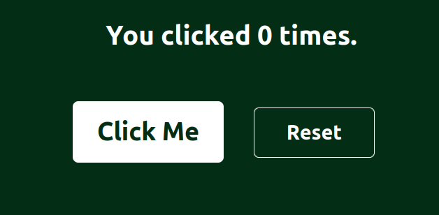

# Counter App

A simple React and TypeScript application demonstrating state management, component reusability, and Tailwind CSS styling. The app features a counter that increases when clicked and smoothly resets back to zero using an interval.

The Counter App is a minimal project built to explore key React concepts such as functional components, state management with hooks, and prop-driven reusability.  
It uses Tailwind CSS for styling and transitions, offering a modern and responsive interface.  

The app includes:
- A **Counter component** that manages state and logic
- A **Button component** that accepts props for customization
- Smooth hover effects and responsive layout


## Features

- Increment counter on button click  
- Gradual reset back to zero using a timed interval  
- Reusable Button component with props  
- Styled using Tailwind CSS with transitions and hover states

## Technologies Used

- React (Functional Components)
- TypeScript
- Tailwind CSS
- Vite (Development Tool)

## How to Run the Project

1. Clone the repository:
```bash
  git clone https://github.com/Guhirwa/SimpleCounter.git
```

2. Install Dependencies:
```bash
  npm install
```

3. Run the Development Server:
```bash
  npm run dev
```

4. Open you browser and Visit:
```bash
  http://localhost:5173
```

## Demo


### Author

Christian GUHIRWA <br />
Email: [guhirwachristian004@gmail.com](mailto:guhirwachristian004@gmail.com) <br />
Github: [Guhirwa](https://github.com/Guhirwa)
